

Fernerkundung in der Landschaftsplanung - Tag 5 - Überwachte Klassifikation in QGIS und R

**Autoren:** Dieses Tutorial wurde von Fabian Fassnacht entwickelt.

### Lernziele

In diesem Tutorial lernen Sie zuerst wie Sie Referenz- bzw. Trainingsdaten in QGIS digitalisieren können und danach eine überwachte, Pixel-basierte Klassifikation in R durchführen. Für die Klassifikation werden wir einen Klassifikator aus dem Bereich des maschinellen Lernens kennenlernen.

Nach Absolvieren des Tutorials, sind Sie in der Lage eigenständig eine Pixel-basierte Klassifikation eines Satellitenbildes durchzuführen.

Ergebnis der Klassifikation wird eine thematische Karte sein, in der jeder Pixel einer von 7 Landbedeckungsklassen zugeordnet ist. Davon repräsentieren 3 Landbedeckungsklassen versiegelte Gebiete und wir werden dann nächste Woche diese Klassen in einem Nachbearbeitungsschritt in eine große Versiegelungsklasse zusammenführen.

### Daten

Die für das Tutorial benötigten Sentinel-2 Daten finden Sie hier:

https://drive.google.com/file/d/1iCHiZd-duIiMovfzVCqtVuusAyhdn3lr/view?usp=sharing

##  Teil 1 - Sammeln von Referenz-/Trainingsdaten in QGIS

Um Referenzdaten für die überwachte Klassifikation zu sammeln, laden wir zuerst das Satellitenbild in QGIS. Entweder per drag & drop oder per

**Layer ⇒ Add Layer ==> Add Raster Layer**

Danach verändern wir die Visualisierung in dem wir die Bandkombination zu einer Echtfarbendarstellung (RGB) ändern. Dafür öffnen wir die Eigenschaften ("Properties") des Rasterlayers wie in Abbildung 1 dargestellt.  

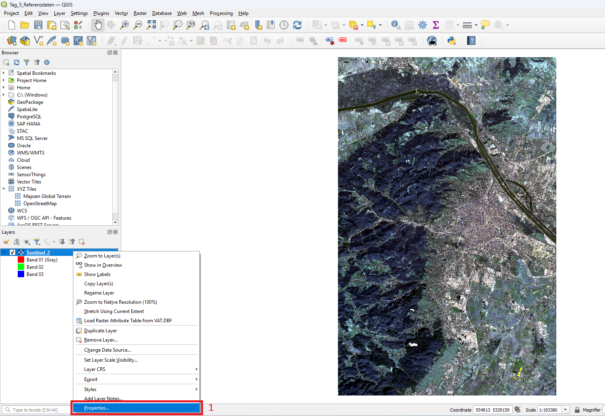

**Abbildung 1: Laden des Sentinel-2 Satellitenbildes**

Dann wählen wir die "Symbology"-Sektion aus und setzen das rote Band auf Band 3, das Grüne Band auf Band 02 und das Blaue Band auf Band 1 (markiert mit 1 in Abbildung 2) und bestätigen mit "Apply" und dann "OK".

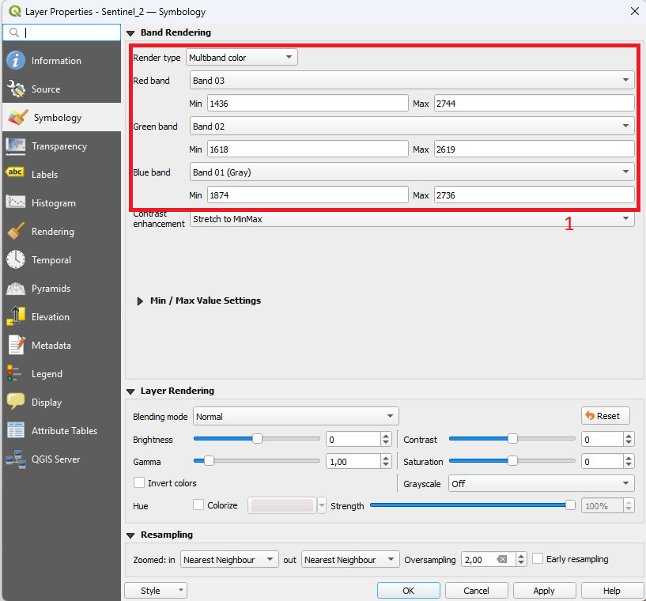

**Abbildung 2: Veränderung der Visualisierungseinstellungen**

Als zusätzliche Informationsquelle - neben dem Sentinel-2 Satellitenbildes - werden wir Google Earth Satellitenbilder verwenden. Diese können in QGIS als XYZ-Weblayer hinzugefügt werden. Hierfür selektieren wir im "Browser"-Fenster wie in Abbildung 3 dargestellt den Eintrag "XYZ Tiles", dann machen wir einen Rechtsklick auf den Eintrag und wählen "New Connection".

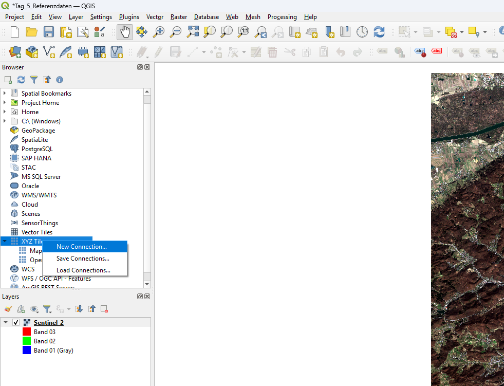

**Abbildung 3: Google Earth Layer hinzufügen**

Im nun erscheinenden Dialog (Abbildung 4) geben wir im Feld **URL** folgende URL ein:

http://mt0.google.com/vt/lyrs=s&hl=en&x={x}&y={y}&z={z}

Dazu wählen wir als Name noch "Google Earth Satellite" oder etwas vergleichbares und bestätigen mit "OK".

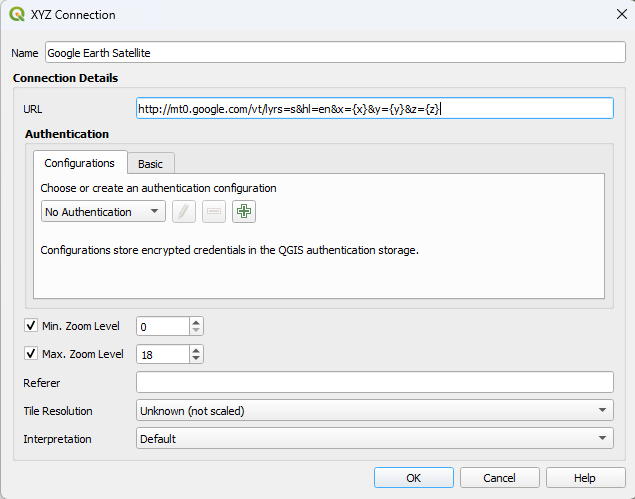

**Abbildung 4: Google Earth Layer hinzufügen**

Daraufhin erscheint ein neuer Eintrag in der Rubrik "XYZ Tiles" mit dem gerade eingegebenen Namen. Wenn wir nun diesen Eintrag "doppelklicken" so wird in QGIS ein neuer Layer hinzugefügt, der die Satellitenbilder zeigt, welche man ansonsten z.B. über Google Maps aufrufen kann (Abbildung 5).

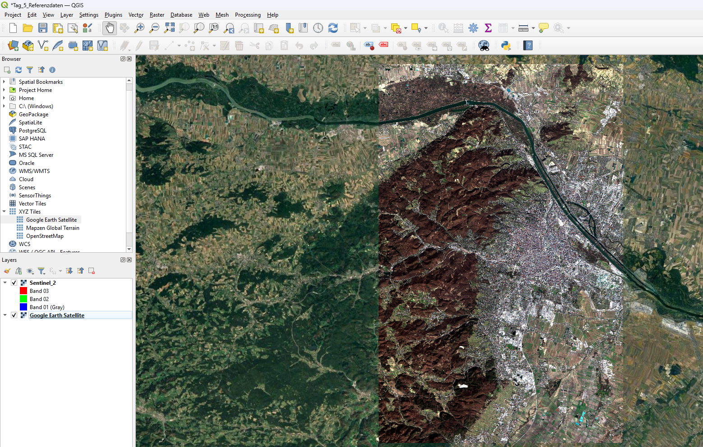

**Abbildung 5: QGIS mit Google Earth Daten**

Der Vorteil von den Google Earth Daten liegt darin, dass die räumliche Auflösung (nach Heranzoomen an ein bestimmtes Gebiet) deutlich höher ist als die der Sentinel-2 Daten. Dies hilft dabei, die Referenzpunkte für bestimmte Landbedeckungsklassen, die wir im nächsten Schritt erfassen möchten zu identifizieren. Es wird empfohlen, zwischen den Sentinel-2 Daten und den Google Earth Daten hin und herzuschalten, um sicherzugehen, dass kleinere Lageungenauigkeiten nicht später zu Problemen führen könnten. Sie können das bereits einmal ausprobieren indem Sie an eine bestimmte Stelle im Satellitenbild heranzoomen (z.B. mit dem Mausrad) und dann zwischen Sentinel-2 und dem Google Earth Layer hin-und herschalten (aktivieren und deaktivieren der Layer im "Layers"-Fenster). Sie werden sehen, dass an vielen Stellen ein kleiner Lageversatz zu erkennen ist und die Visualisierung den Eindruck macht etwas "zu springen". 

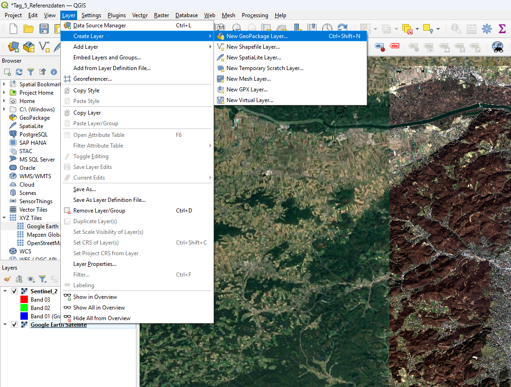

**Abbildung 6: Erstellung der Vektordatei**

Als nächsten Schritt erstellen wir nun eine leere Vektordatei, um Referenzpunkte für unsere überwachte Klassifikation zu sammeln. Hierfür wählen wir - wie in Abbildung 6 dargestellt - im Hauptmenü von QGIS:

**Layer ⇒ Create Layer ⇒ New Geopackage Layer...** 

Im nun erscheinenden Fenster legen wir zum einen den Dateinamen (in meinem Fall "Referenzdaten.gpkg") der neu zu erstellenden Datei und den Pfad fest (markiert mit 1 in Abbildung 6), als Geometrie-Typ wählen wir "Punkt" ("Point") (markiert mit 2 in Abbildung 6) und WICHTIG: als Koordinatensystem wählen wir dasselbe Koordinatensystem wie für das Satellitenbild (markiert mit 3 in Abbildung 6).

Zusätzlich erstellen wir für die Attributtabelle des Vektorfiles bereits ein neues Feld (Spalte) - dafür geben wir "class" in das Feld "Name" ein, wählen als "Type" die Option "Text (string)" und geben als "Maximum length" 50 an (markiert mit 4 in Abbildung 6). Wir fügen das Feld hinzu, indem wir "Add to Fields list" klicken. In Abbildung 6 ist die Situation dargestellt, nachdem das Feld bereits hinzugefügt wurde.

Dann bestätigen wir mit "OK" und es sollte nun ein neuer Layer im "Layer"-Fenster erscheinen.

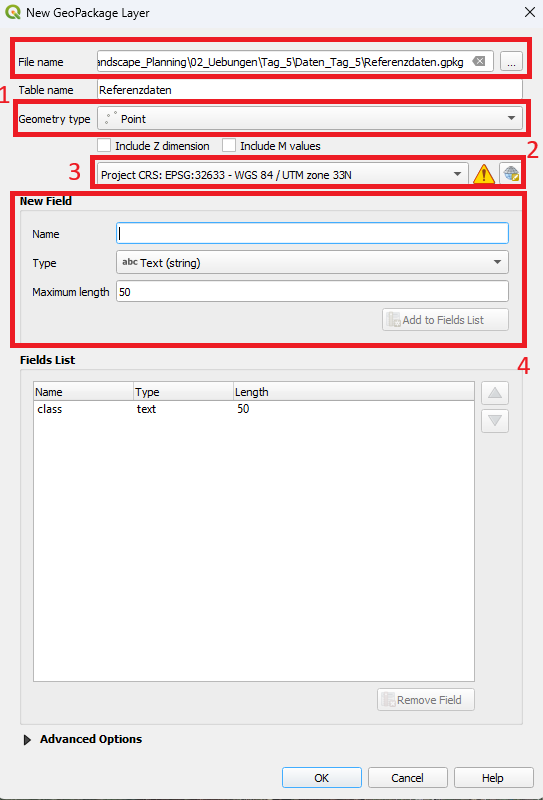

**Abbildung 7: Situation nach Erstellung der Vektordatei**

Nun haben wir alles vorbereitet, um mit dem eigentlichen Sammeln der Referenzdaten zu beginnen. Um dies zu tun, selektieren wir zuerst den neu erstellen Layer im "Layers"-Fenster (markiert mit 1 in Abbildung 7). Dann aktivieren wir den Editiermodus (markiert mit 2 in Abbildung 7). Anschließend wählen wir die Option zum Hinzufügen von neuen Punkten (markiert mit 3 in Abbildung 7). Wir können nun, indem wir mit dem Mausrad und dem Mauscursor an bestimmte Stellen im Satellitenbild heranzoomen, Bildausschnitte identifizieren an denen wir sicher sind, um welche Landbedeckungsklasse es sich handelt und dann an diesen Stellen Punkte setzen.

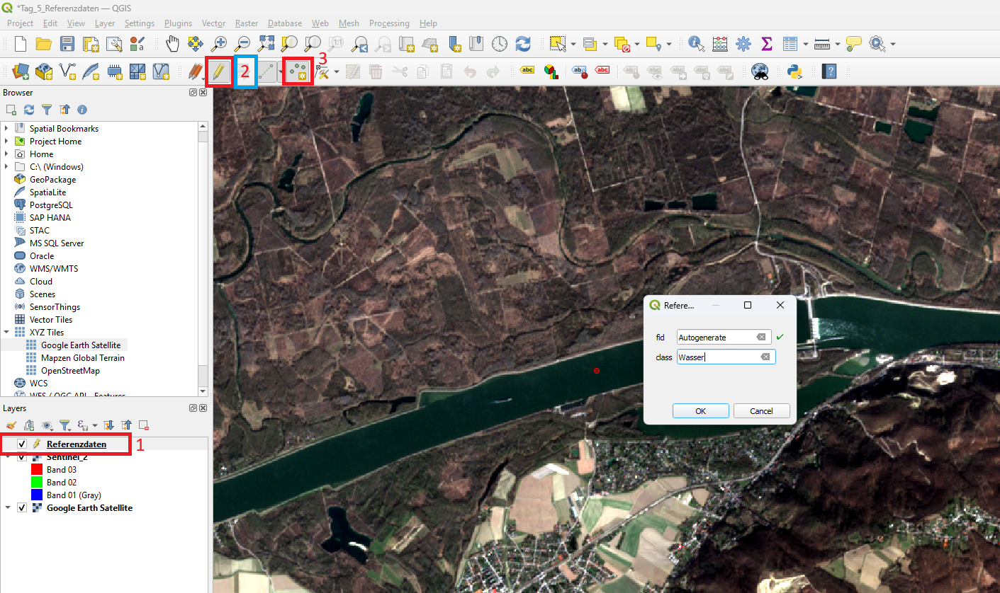

**Abbildung 8: Setzen eines Punktes für die Landbedeckungsklasse Wasser**

In Abbildung 8 ist ein Beispiel für das Setzen eines Punktes für die Landbedeckungsklasse "Wasser" dargestellt. Nachdem ein Mausklick auf ein "Wasserpixel" erfolgt ist, erscheint das in Abbildung 8 gezeigte Fenster und wir können für die Spalte "class" einen Eintrag hinzufügen, in diesem Fall geben wir "wasser" ein. In unserem konkreten Fall werden wir nun jeweils 25 Punkte für die Klassen

- Acker
- Dach_grau
- Dach_rot
- Gruenland
- Strasse
- Wasser
- Wald

setzen. Dabei sollte auf einige Dinge geachtet werden: Einige der Klassen, wie z.B. die beiden Dachkategorien sind in den Google Earth Daten deutlich besser zu erkennen als in den Sentinel-2 Daten. Im Idealfall sollten die Referenzdaten so gesetzt werden, dass wirklich wenig Zweifel daran besteht, dass die gewählten Pixel tatsächlich der jeweiligen Landbedeckungsklasse entsprechen. D.h., es ist ratsam eher Bereiche zu wählen wo die Landbedeckungsklasse deutlich mehr als einen einzelnen Pixel abdeckt und somit z.B. kleinere Lageversätze zwischen den Google Earth Daten und den Sentinel-2 Daten keine Rolle spielen. In Abbildung 9 ist dies für die Klasse "Dach_grau" beispielhaft dargestellt. Die gesetzten Punkte befinden sich alle auf Dächern, die relativ groß sind und auch sonst von eindeutig versiegelten Flächen umgeben sind.

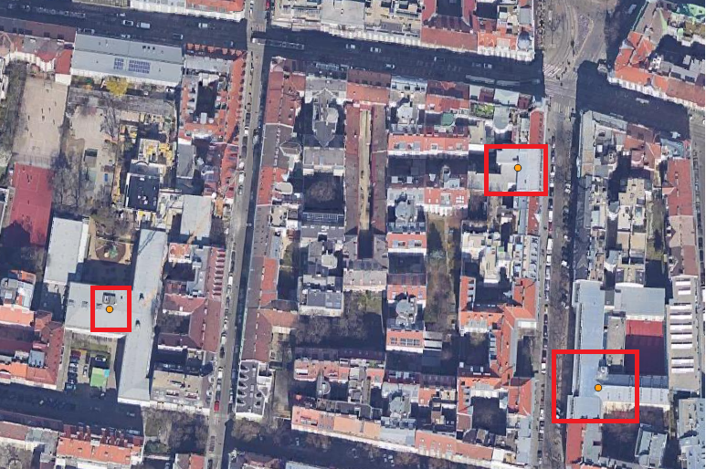

**Abbildung 9: Referenzdatenpunkte für die Klasse "Dach_grau"**

Bitte setzen sie nun für die 7 Landbedeckungsklassen jeweils 25 Punkte und achten Sie darauf, dass sie immer exakt dieselbe Schreibweise verwenden, wenn sie die Landbedeckungsklasse definieren. In meiner Erfahrung macht nes Sinn immer zuerst alle Punkte für eine Klasse zu setzen und danach mit der zweiten Klasse weiterzumachen. Man kann dann auch mit copy & paste die Klassenbezeichnung eingeben und umgeht damit im Idealfall unnötige Tippfehler. Im Idealfall sollten die Punkte relativ gut über das gesamte Satellitenbild verteilt sein, wobei man in der Regel versucht einen Kompromiss zu finden zwischen einer guten Verteilung und effizientem Arbeiten.

Anmerkung: 25 Punkte pro Landbedeckungsklasse sind eine sehr niedrige Zahl an Referenzdaten. Normalerweise werden 50 Punkte als das absolute Minimum angesehen. Da dieses Tutorial nur das Grundprinzip vermitteln soll, ist das akzeptabel, aber allgemein gilt: Je mehr Referenzpunkte und desto besser die Qualität der Referenzpunkte, desto verlässlicher die anschließende Klassifikation.
 
 Wenn Sie alle Punkte gesetzt haben, ist es sehr wichtig den Vektor-Layer zu speichern. Dafür drücken Sie den in Abbildung 8 in blau markierten Button mit der Diskette, direkt neben dem Button welcher den Editormodus des Vektorlayers aktiviert und deaktiviert. Nach dem Speichern können Sie den Editiermodus beenden indem sie nochmal auf den Button gerade genannten Button für den Editiermodus klicken. Sie können auch gerne regelmäßg abspeichern nachdem Sie ein paar Punkte gesetzt haben, um zu verhindern, dass Daten verloren gehen (wenn z.B. der Computer abstürzt).

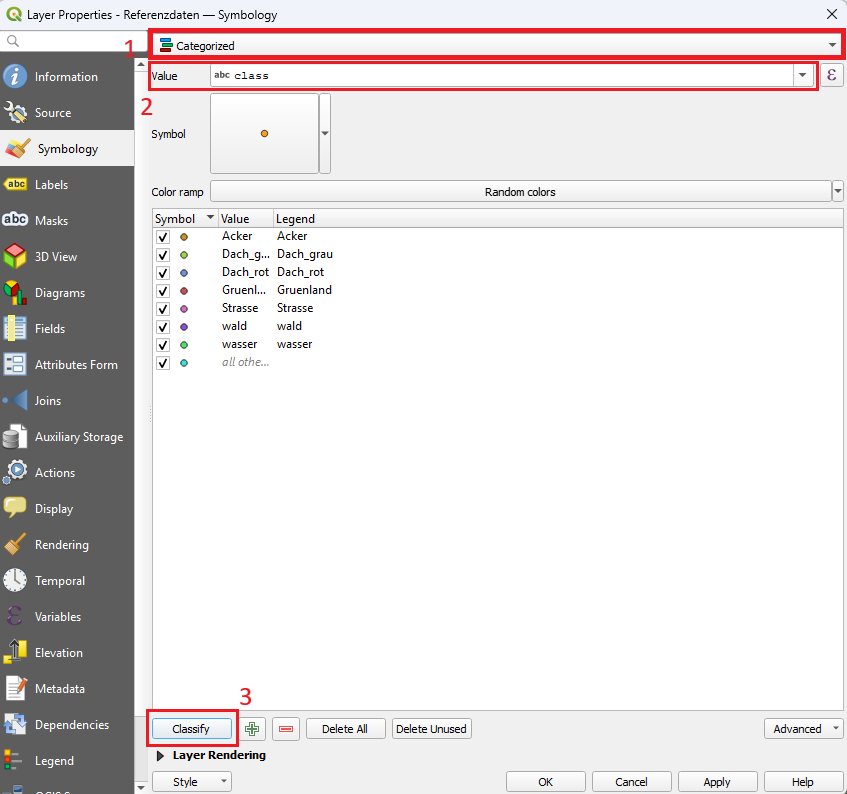

**Abbildung 10: Anpassung der Visualisierung für die Vektordatei**

Optional können Sie die Visualisierung des Vektorfiles anpassen über
 
 **Rechtsklick auf den Layer ⇒ Properties**
 
Dann in der Sektion Symbology die Option "Categorized" auswählen (markiert mit 1 in Abbildung 10), als Value "class" auswählen (markiert mit 2 in Abbildung 10) und dann auf den Button "Classify" (markiert mit 3 in Abbildung 10) klicken. Nun sollten alle digitalisierten Landbedeckungsklassen mit verschiedenen Farben erscheinen. Sollten mehr als 7 Klassen erscheinen, kann es gut sein, dass bei der Bezeichnung der Klassen während dem Digitalisierungsvorgang aus Versehen unterschiedliche Schreibweisen verwendet wurden. Wir bestätigen mit "OK" und sollten nun einen Eindruck in QGIS haben, der mehr oder weniger dem in Abbildung 11 entspricht (die Farben für die jeweiligen Landbedeckungsklassen sind i.d.R. zufällig von QGIS gewählt und werden sich bei Ihnen von denen in der Abbildung dargestellten unterscheiden).

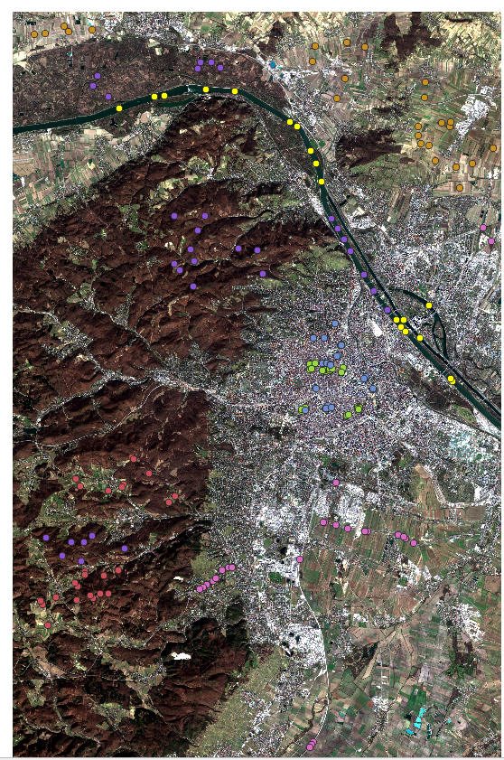

**Abbildung 11: Situation nach der Änderung der Visualisierungseinstellungen**

Wir haben nun erfolgreich unsere Referenzdaten für die überwachte Klassifikation gesammelt und werden nun nach R wechseln, um diese dort durchzuführen. Dafür werden wir die erstellte Vektordatei benötigen. Stellen Sie daher bitte sicher, dass Sie wissen wo Sie die Datei gespeichert haben.

##  Teil 2 - Extraktion von Spektren und Visualisierung der Spektren in R

Im Folgenden werden wir zuerst lernen wie wir spektrale Signaturen / Spektren aus den Sentinel-2 Daten an unseren Referenzpunkten, die wir gerade in QGIS erstellt haben, extrahieren und visualisieren können. Danach, im Teil 3, werden wir dann die überwachte Klassifikation durchführen.

Wenn Sie sichergehen wollen, dass der Code funktioniert oder wenn Sie mit ihrer selbst erstellten Datei Probleme haben, können Sie anstelle ihrer eigenen auch eine von mir erstelle Datei hier herunterladen:

https://drive.google.com/file/d/1er1YRzxdUP3XV8JYDNJeRlr-T6rbNq10/view?usp=sharing

Als ersten Schritt öffnen wir RStudio und öffnen ein neues R-Skript mittels:

**File ⇒ New File ⇒ >R Script**

Dann laden wir die benötigen R-Pakete in dem wir folgende Zeilen ausführen:

	require(terra)
	require(e1071)
	require(matrixStats)
	require(randomForest)

Sollte ein oder mehrere Pakete nicht installiert sein, so können wir dies - wie bereits gelernt - über die Option 

**Tools ⇒ Install Packages**

und den dann folgenden Dialog, oder alternativ über den Befehl:

	install.packages("NameDesPakets")

tun.

Als nächstes laden wir unser Sentinel-2 Satellitenbild und die Referenzdaten, die wir soeben gesammelt haben. Dafür führen wir folgenden Code aus (genauere Erläuterungen finden sich direkt in den Kommentaren im Code):

	# Setzen des Pfades wo die zu ladenden Dateien gespeichert sind. !!! Diese Codezeile
	# muss angepasst werden !!!
	setwd("C:/02_Lehre/OEKB100130_Remote_Sensing_Landscape_Planning/02_Uebungen/Tag_5/Daten_Tag_5")
	
	# Der list.files() Befehl zeigt alle Dateien an, die im aktuellen Ordner gespeichert sind.
	# das hilft um zu überprüfen, ob man den Pfad richtig gesetzt hat.
	list.files()
	
	# Nun laden wir das Satellitenbild mit dem "rast()" Befehl und den Vektordatensatz mit dem "vect()" Befehl. Beide Befehle sind im "terra"-Paket enthalten
	s2 <- rast("Sentinel_2.tif")
	ref <- vect("Referenzdaten.gpkg")

	# Der "table()" Befehl veranlasst im Prinzip die Erstellung einer Histogramm-ähnlichen Tabelle einer Vektordatei. Was hier konkret passiert ist, dass der Befehl auf Spalte mit dem Titel "class" in der Attributtabelle der Vektordatei zugreift. Diese Spalte enthält die Informationen über die Landbedeckungsklassen für jeden Punkt der Vektordatei (so wie Sie vorher in QGIS eingegeben wurde). Nun analysiert der Befehl alle Einträge in der Spalte und überprüft wie häufig jeder Eintrag vorkommt. Wenn bei der Digitalisierung im ersten Teil nichts schiefgegangen ist, sollten nun jeweils 25 Einträge pro Landbedeckungsklasse in der Konsole angezeigt werden (Abbildung 12).
	table(ref$class)

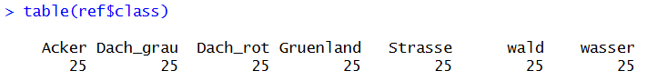

**Abbildung 12: Ansicht Konsolenausgabe**

Wir können uns nun zusätzlich auch einige Eigenschaften der Rasterdatei des Satellitenbildes anzeigen lassen. Hierfür nutzen wir einige Befehle wiederum aus dem terra-Paket, die jeweils eine direkte Ausgabe in der Konsole bewirken (Ausgaben sind hier im Tutorial nicht gezeigt):

	# Anzeigen der Anzahl der Spalten des Rasterbildes
	ncol(s2)
	# Anzeigen der Anzahl der Zeilen des Rasterbildes
	nrow(s2)
	# Anzeigen der Anzahl der Kanäle/Spektralbänder des Rasterbildes
	nlyr(s2)
	# Statistische Zusammenfassung aller Bänder
	summary(s2)
	# Statistische Zusammenfassung eines einzelnen Bandes (hier das Band 3) ⇒ Wir können auf einzelne Bänder eines Rasterdatensatzes mit einer doppelten eckigen Klammer zugreifen. Eine einfache eckige Klammer ermöglicht den Zugriff auf einzelne Rasterwerte über die Angabe einer Spalten und Zeile.
	summary(s2[[3]])
	# Anzeigen des geographischen Ausmaßes des Bildes
	ext(s2)
	# Anzeigen des Koordinatenreferenzsystems in dem das Rasterbild gespeichert ist
	crs(s2)
	
Wir können uns das Satellitenbild und die Vektordaten auch anzeigen lassen:

	# Wie bereits an Tag 3 gelernt, können wir das Rasterbild auch plotten (hier in einer Infrarot-Falschfarbendarstellung)
	plotRGB(s2, r=8, g=3, b=2, stretch="hist")
	# Dazu können wir auch noch die Vektordaten über das Rasterbild plotten. Dabei wird der Befehl "par(new=T)" dazu verwendet zu verhinden, dass die Vektordateien in einem neuen Plot verarbeitet werden sondern über dem bereits geplotteten Rasterbild angezeigt werden
	par(new=T)
	plot(ref, col=as.factor(ref$class), add=T)

Die sollte nun zu einer Plot-Ausgabe führen, die ungefähr so aussieht wie in Abbildung 13 dargestellt.

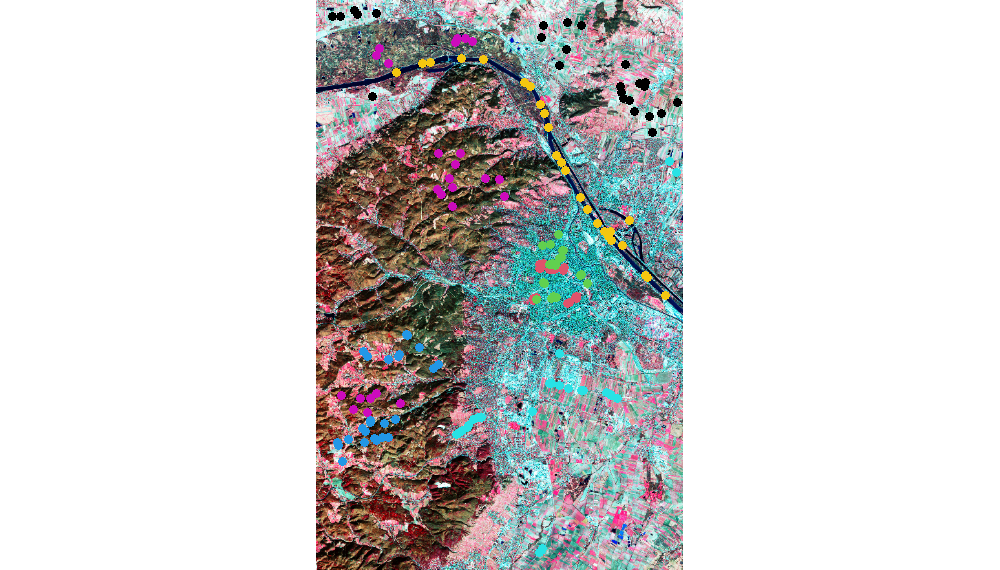

**Abbildung 13: Satellitenbild und Vektordaten in R**

Nachdem wir nun einiges über unser Rasterbild und die Vektordatei erfahren haben, sind wir bereit die eigentliche Klassifikation durchzuführen.

Hierfür ist der erste Schritt, dass wir die Vektordatei über das Satellitenbild legen und an jedem Punkt wo ein Vektorpunkt verortet ist, die entsprechenden Pixelwerte aus der Rasterdatei extrahieren. Dies führt dazu, dass wir für jeden Vektor-Datenpunkt für die wir die Landbedeckungsklasse kennen ein Spektrum zur Verfügung haben.

Dieser Prozess geht mit einer einzelnen Zeile:

	# Extrahieren der spektralen Signaturen des Satellitenbildes (Spektren) für jeden Vektordatenpunkt. Der Parameter "ID=F" verhindert, dass neben den Rasterwerten auch eine ID erstellt wird. Diese wird in unserem Fall nicht benötigt.
	ref_data_tr <- extract(s2, ref, ID=F)

Die extrahierten Spektren können wir uns jetzt ansehen. Dafür verwenden wir einen sogenannten "for-loop" welcher es uns ermöglicht denselben Befehl viele Male hintereinander auszuführen und dabei immer nur den Eingangsdatensatz zu verändern. Es gibt in R auch noch weitere, kompaktere Arten dasselbe zu erreichen, aber der "for-loop" ist konzeptionell relativ einfach zu verstehen und auch häufig einfacher zu implementieren. Bitte lesen Sie sich die Beschreibung sorgfältig durch und fragen Sie nach, wenn etwas unklar sein sollte.

	# Als erten Schritt schließen wir alle momentan noch offenen Plotfenster mit dem "dev.off()" Befehl.
	dev.off()

Anschließend wenden wir einen Trick an. Wir plotten zuerst ein einzelnes Spektrum, um die Basis-Ploteinstellungen zu setzen (insbesondere auch die Achsenbeschriftungen). Das besondere an dem Plot ist, dass wir als Farbe "weiss" verwenden und den Plot auf einen weissen Hintergrund plotten. D.h., die Daten des Plots werden nicht sichtbar sein (nur die Achsen und die Achsenbeschriftung). Die Einstellungen des Befehls werden im Folgenden erläutert:

**"1:10, rep(8000,10)"** repräsentieren die Daten, die wir plotten. In diesem Fall sind es künstlich erstellte Daten. 1:10 ist eine Sequenz von Zahlen von 1 bis 10 n Schritten von 1, also 1,2,3,4,5,6,7,8,9,10. rep(8000,10) erstellt einen Vektor in dem die Zahl "8000" 10 mal hintereinander steht. **"rep"** steht für "repetition" also Wiederholung. Also der zweite Teil der Daten, die wir plotten ist ein Vekor der so aussieht: 8000, 8000, 8000, 8000, 8000, 8000, 8000, 8000, 8000, 8000. Die Einstellung **"type=l"** bewirkt, dass die Daten, die prinzipiell als Punkte in einem Koordinatensystem geplottet werden (1:10 = Werte für die x-Achse, rep(8000,10) = Werte für die y-Achse) jeweils miteinander verknüpft werden und damit der Eindruck einer Linie entsteht. 

**"col=white"** bewirkt dass die Daten in weiss geplottet werden. Sie können "white" gerne einmal in "black" ändern, dann sehen sie was der plot eigentlich zeigt. Die Einstellung **"ylim=c(0,8000)"** definiert den Wertebereich der y-Achse der hier auf den Bereich zwischen 0 und 8000 festgelegt wird. Dieser Bereich basiert auf dem Wissen, dass die Sentinel-2 Daten zwischen 0 und 10000 skaliert sind wobei 10000 = 100% Reflektanz entspricht, die faktisch auf der Erdoberfläche nie erreicht wird. Deswegen skalieren wir den bereich zwischen 0 und 80% Reflektanz. Die Verwendung des Wertebereichs zwischen 0 und 10000 anstatt von zwischen 0 und 1 liegt darin begründet, dass Kommazahlen (Datentyp "float" oder "double") deutlich mehr Speicherplatz auf dem Computer benötigen als ganze Zahlen ("Integer"). Da Satellitenbilder sehr groß sind, macht dies einen wirklichen Unterschied. 

Die Einstellung **"xlim=c(1,10)"** definiert dementsprechend den Wertebereich der x-Achse auf die Werte 1-10 was in unserem Fall den 10 Bändern von Sentinel-2 entspricht. Richtiger wäre es hier die tatsächlichen Wellenlängen zu verwenden und nicht die Band-ID aber der enfachheithalber bleiben wir jetzt erstmal bei dieser nicht ganz richtigen Form. 

Schließlich werden mit **"ylab"** und **"xlab"** noch die Achsenbeschriftungen festgelegt.

	plot(1:10, rep(8000,10), type="l", col="white", ylim=c(0,8000), xlim=c(1,10), ylab="Reflectance", xlab="S2 band")

Nun kommen wir zum for-loop. Wir können erkennen, dass innerhalb der geschweiften Klammer im Prinzip nur der oben beschriebene Plotbefehl mit einer kleinen Modifikation zu finden ist, sowie der Befehl **"par(new=T)"**, den wir bereits oben kennengelernt haben (gerne nochmal nachlesen was er bedeutet, falls es nicht mehr präsent ist). Die geschweifte Klammer definiert die Befehle, die im for-loop wiederholt werden sollen. Dieser Teil wird solange wiederholt werden, bis die in der Zeile **"for (i in 1:nrow(ref_data_tr))"** gegebene Bedingung erfüllt ist. 

Was für eine Bedingung ist hier nun definiert? Man kann diese Zeile wie folgt übersetzen: Führe untenstehenden Befehl solange aus bis die Variable i alle Werte von 1 bis der Anzahl der Zeilen des dataframes "ref_data_tr" (welcher die Spektren enthält) einmal angenommen hat. Also in unserem konkreten Beispiel wird der Befehl in den geschweiften Klammern 175 mal ausgeführt, da wir im dataframe "ref_data_tr" 175 Spektren gespeichert haben (nämlich 7 Landbedeckungsklassen mit jeweils 25 Datenpunkten ==> 7 * 25 = 175). Der dataframe hat daher 175 Zeilen (der Befehl nrow(ref_data_tr) wird als Ausgabe die Zahl 175 haben). In anderen Worten, der Code-Teil "1:nrow(ref_data_tr)" führt zu einem Vektor der alle Zahlen von 1 bis 175 in Schritten von 1 enthält: 1,2,3,4,5,6,...173,174,175. 

Was bedeutet das nun konkret für unsere Befehl in den geschweiften Klammern? In der ersten Runde des for-Loops nimmt die Variable i den Wert 1 an. D.h., im plot-Befehl sind die zu plottenden Daten definiert durch x-Achsenwerte = 1:10 und y-Achsenwerte = ref_data_tr[i,]. Wenn wir uns an Tag 3 erinneren, wissen wir, dass die eckigen Klammern den Zugriff auf einen dataframe (eine Tabelle/Matrix) steuern, wobei der erste Eintrag vor dem Komma die Zeile definiert und der zweite Eintrag nach dem Komma die Spalte. In unserem konkreten Fall: ref_data_tr[i,] mit i=1 bedeutet das, dass wir die erste Zeile des dataframe verwenden und da für die Spalte kein Wert angegeben ist, nehmen wir alle Spalten. Dies entspricht dem Spektrum des ersten Datenpunktes unserer Vektordatei. Dieses wird nun geplottet. Alle anderen Teile des Plot Befehls sollten bereits von oben bekannt sein mit einer Ausnahme: Bei der Farbe verwenden wir nun anstatt "white" den Befehl: "col=as.factor(ref$class)[i]" Dies ist nun etwas komplizierter zu erklären und wir gehen hier nicht im Detail darauf ein, aber die Zusammenfassung ist, dass dieser Befehl bewirkt, dass alle Spektren einer Landbedeckungsklasse (wie in der Spalte "class" unserer Vektordatei definiert) in einer jeweils anderen Farbe geplottet werden. Dazu bewirken die Befehle: ylab="", xlab="" und axes=F, dass keine Achsen und keine Achsenbeschriftungen geplottet werden. Diese wurden ja bereits durch den "leeren" Plot vor dem for-loop erstellt. Dieser Trick wird angewandt, da ansonsten 175 mal dieselben Achsen geplottet werden, was zu unschönen Plotausgaben in R führt.

Der Plotbefehl wird nun zuerst mit i=1 durchgeführt, danach mit i=2, dann mit i=3, usw. bis i=175. Dann ist das for() - Kriterium erfüllt und der Loop wird automatisch beendet.

	for (i in 1:nrow(ref_data_tr)){
	  
	  par(new=T) 
	  plot(1:10,ref_data_tr[i,],  ylab="", xlab="", axes=F, type="l", col=as.factor(ref$class)[i], ylim=c(0,8000), xlim=c(1,10))

	  }

Wenn wir den Loop ausführen sollte dies zu einer Plotausgabe führen, die ungefähr so aussieht wie die in Abbildung 14 dargestellte.

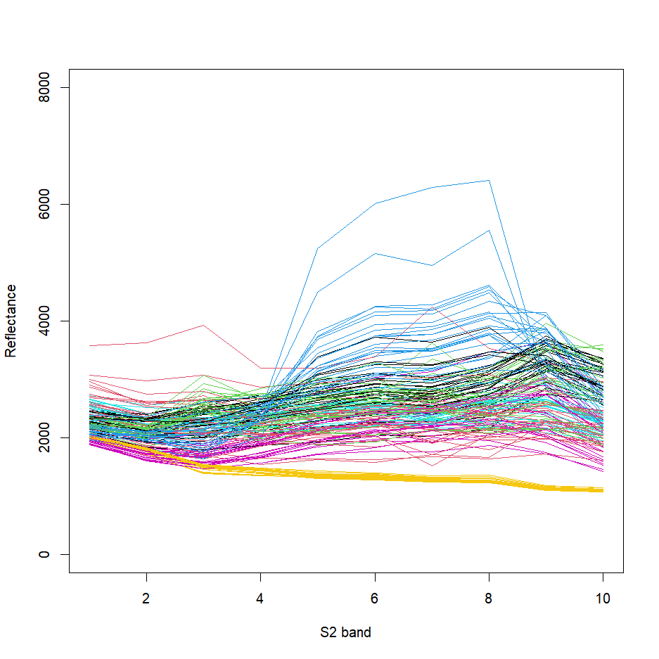

**Abbildung 14: Plot aller 175 Spektren**

Wir können nun sehen, dass diese Ausgabe nicht sehr übersichtlich ist, da insgesamt 175 verschiedene Spektren, die sich teilweise stark überlappen, gleichzeitig dargestellt werden. Im Folgenden werden wir die Darstellung etwas optimieren indem wir für jede Landbedeckungsklasse den Mittelwert und die Standartabweichung der 25 Beobachtungen (die 25 Vektorpunkte pro Landbedeckungsklasse) für jedes Spektralband des Sentinel-2 Bildes berechnen und dann nur das mittlere Spektrum plotten sowie den Bereich, der dem Mittelwert plus/minus eine Standartabweichung entspricht. Dieser Plot ist etwas aufwändiger und benötigt mehrere Schritte. Ich werde diese nun nicht auf demselben Detailniveau wie die Schritte zuvor erklären (da der Plot nicht essenziell für die überwachte Klassifikation ist, die ja das eigentliche Ziel des Tutorials ist), sondern nur grob beschreiben was jeweils passiert. Prinzipiell sollten aber die meisten Schritte basierend auf dem bereits Gelernten herleitbar sein.

Die jeweiligen Erläuterungen finden sich teilweise direkt im Code:

	# Zuerst fügen wir die Information bezüglich der Landbedeckungsklasse zu unserem dataframe hin mit dem "$Spaltenname"-Befehl können wir eine neue Spalte zu einem dataframe hinzufügen
	ref_data_tr$class <- ref$class
	
	# jetzt sind wir bereit, um für die 25 Datenpunkte für jede Landbedeckungsklasse den Mittelwert und die Standardabweichung für jeden Spektralkanal zu berechnen
	# um dies zu ermöglichen erstellen wir zuerst eine leere sogenannte "Liste". Dies ist in R ein sehr flexibler "Datencontainer" in den man sehr flexibel Daten speichern kann.
	meansd <- list()

Nun starten wir einen for-loop in dem wir immer zuerst unseren Gesamtdatensatz, der alle Spektren aller Landbedeckungsklassen enthält, reduzieren auf einen Datensatz, der nur die Spektren einer einzelnen Landbedeckungsklasse enthält (d.h., 25 Datenpunkte). Für diese 25 Datenpunkte werden dann immer der Mittelwert und die Standardabweichung für jeden Sentinel-2 Band (d.h., für jede Spalte) mittels den Befehlen "colMeans2()" und "colSds()" berechnet. Danach werden die berechneten Mittelwerte und Standardabweichungen in der Liste gespeichert und der Prozess wird für die nächste Landbedeckungsklasse wiederholt
	
	for (i2 in ref$class){
	  
	  # Erstellung eines reduzierten Datensatzes welcher nur die Datenpunkte einer Landbedeckungsklasse enthält
	  sp <- ref_data_tr[ref_data_tr$class == i2,]
	  # basierend auf dem reduzierten Datensatz werden nun Mittelwert und Standardabweichung für alle Spalten des dataframes berechnet
	  means <- colMeans2(as.matrix(sp[,1:10]))
	  sds <- colSds(as.matrix(sp[,1:10]))
	  # Zusammenfügung von Mittelwert und Standardabweichung in eine einzelne Variable
	  fin <- cbind(means, sds)
	  # Speichern der Variable in die Liste
	  meansd[[i2]] <- fin
	  # Wiederholung mit der nächsten Landbedeckungsklasse
	  
	}

Nun können wir die gerade berechneten Mittelwerte und Standardabweichungen dazu verwenden für unsere sieben Landbedeckungsklassen einen übersichtlicheren Plot zu erstellen:

	# Schließen etwaiger noch offener Plotfenster
	dev.off()
	# Plotten eines "leeren" plottes (siehe Beschreibung oben)
	plot(1:10, rep(10000, 10), type="l", col="white", ylim=c(0,10000), ylab="Reflectance [10000=100%]", xlab="# Band")
	# Hinzufügen einer Legende
	legend("topright",
       legend=c("Wasser", "Wald", "Gruenland", "Acker", "Strasse", "Dach_grau", "Dach_rot"),
       col=1:7,
       lty=1,
       cex=0.8,        # Textgröße ändern
       lwd=2,          # Festlegen der Dicke der Linien in der Legende
       bty="n",        # keine Box um die Legende
       inset=0.02,     # Platzierung der Legende
       y.intersp=0.5)  # Abstände zwischen den Legendeneinträgen anpassen

	# Plotten der Mittelwert-Spektren jeder Landbedeckungsklasse (durchgängig Linie) sowie zweier weiterer Linien, die dem Mittelwertspektrum plus/minus der Standardabweichung für den jeweiligen Kanal entsprechen (gestrichelte Linien) mittels eines for-loops:

	for (i3 in 1:7){
	  
	  
	  par(new=T)
	  # plot des Mittelwertspektrums
	  plot(1:10, meansd[[i3]][,1], type="l", col=i3, ylim=c(0,10000), add=T, lwd=2, axes=F, ann=F)
	  par(new=T)
	  # plot des Mittelwertspektrums + Standardabweichung
	  plot(1:10, meansd[[i3]][,1]+meansd[[i3]][,2], type="l", col=adjustcolor(i3, alpha.f=0.5), ylim=c(0,10000), add=T, lty=2, axes=F, ann=F)
	  par(new=T)
	  # plot des Mittelwertspektrums - Standardabweichung
	  plot(1:10, meansd[[i3]][,1]-meansd[[i3]][,2], type="l", col=adjustcolor(i3, alpha.f=0.5), ylim=c(0,10000), add=T, lty=2, axes=F, ann=F)
	  
	  
	}
 
Dies sollte zu einer Abbildung führen die ungefähr so aussieht wie die in Abbidung 15 dargestellte.

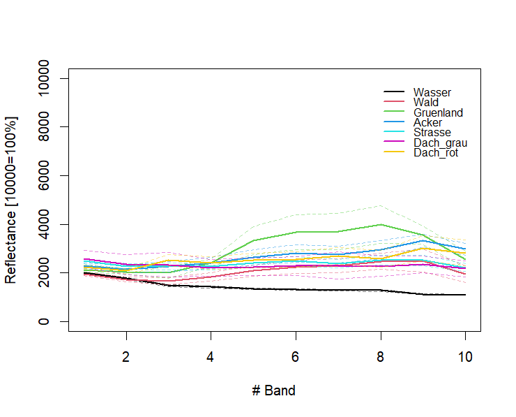

**Abbildung 15: Plot der Mittelwert-Spektren plus minus Standartabweichung aller sieben Landbedeckungsklassen**

In diesem Plot können wir nun etwas besser erkennen inwiefern sich die einzelnen Landbedeckungsklassen in Ihrer spektralen Signatur unterscheiden bzw. überlappen. Wir sehen, dass obwohl es Überlappungen gibt, die meisten Klassen hinschtlich Ihrer Mittelwerte sich doch in mindestens einem der Sentinel-2 Bänder relativ gut von den anderen Klassen trennen lassen. Was darauf hindeutet, dass die Klassen ganz gut zu klassifizieren sein sollten.

**Bitte schließen Sie RStudio nicht** - der nun folgende Teil 3 schließt direkt an und die bereits geladenen Daten werden weiterverwendet.

##  Teil 3 - Überwachte, pixel-basierte Klassifikation mit Support Vector Machines in R

Wir werden nun ein Klassifikationsverfahren aus dem Bereich des maschinellen Lernens verwenden, um unser Sentinel-2 Bild zu klassifizieren und damit eine thematische Karte zu erstellen. Bei dem Verfahren handelt es sich um den Algorithmus "Support Vector Machines" (**SVM**), den wir heute bereits in der Vorlesung kurz kennengelernt haben. Das Ziel von heute ist es den Klassifikator auf ein einzelnes Sentinel-2 Bild in einem Standartverfahren anzuwenden. Kommende Woche werden wir uns damit beschäftigen, wie wir die Ergebnisse über verschiedene Vorverarbeitungsschritte und Anpassungen weiter verbessern können.

### Datenvorbereitung und Parameter-Tuning

Um den Support Vector Machines-Algorithmus anwenden zu können, müssen wir dem Algorithmus die sogenannte "Response"-Variable und die sogenannten "Prädiktoren" übergeben. Synonyme für "Response"-Variable sind auch "Zielvariable" oder "Zu erklärende Variable". Synonyme für "Prädiktoren" sind z.B. "features" oder "erklärende Variablen" - je nachdem in welcher Community man sich befindet, werden unterschiedliche Begriffe verwendet und dies kann manchmal zu Komplikationen führen. In unserem Fall ist die "Response"-Variable die Landbedeckungsklasse und die "Prädiktoren" die 10 spektralen Bänder des Sentinel-2 Bildes.

Nun aber zur eigentlichen Klassifikation, die aus zwei Teilen besteht: Zuerst werden die optimalen Einstellungen für den Algorithmus automatisch gesucht und danach der Algorithmus trainiert, validiert und auf das gesamte Satellitenbild angewendet.

Zuerst speichern wir die Prädiktoren und die Response-Variable in separaten Variablen in R ab:

	trainval <- ref_data_tr[,1:10]
	lc_classes <- ref_data_tr$class

Hier enthält die Variable **"trainval"** nun die 175 spektalen Signaturen der 175 Referenzpunkte, die wir vorher gesammelt haben und die Variable **"lc_classes"** enthält die dazu passenden (d.h., in derselben Reihenfolge gespeicherten) Informationen zu den Landbedeckungsklasen, d.h. unsere Response-Variable, die wir basierend auf den spektralen Signaturen vorhersagen wollen. In anderen Worten, wir wollen, dass der Algorithmus am Schluss in der Lage ist, basierend auf einer spektralen Signatur eines Sentinel-2 Pixels die Landbedeckungsklasse richtig vorherzusagen.

Nun sind wir bereit, das sogenannte "Parameter-Tuning" für den Support Vector Machines Algorithmus durchzuführen. Wir können dies mir dem folgenden Code tun (siehe auch Kommentare direkt im Code):

	# in R enthalten einige Algorithmen stochastische Elemente (d.h., bestimmte Teile von Algorithmen werden mit zufällig gewählten Zahlen initiiert). Mit dem Befehl set.seed() kann man sicherstellen, dass bei mehreren Durchläufen desselben Algorithmus' dieselben Zufallszahlen verwendet werden. Dies ist wichtig, wenn man Ergebnisse genau reproduzieren möchte.
	set.seed(11)
	
Als nächstes suchen wir die besten Einstellungen für die zwei Parameter **gamma** und **cost** - im Folgenden werden wir zuerst lernen wie das in R funktioniert und danach folgen nochmal ein paar kurze Erläuterungen zu gamma and cost (Wiederholung zu den bereits in der Vorlesung gehörten Inhalten).

Um die besten Einstellungen zu finden, wird eine sogenannte **grid-search** durchgeführt. Dies ist ein relativ einfaches Prinzip. Sowohl für **gamma** als auch für **cost** werden eine Reihe von Zahlenwerten (in einem sinnvollen Wertebereich, den man aus der Literatur kennen  muss) definiert, die danach in allen Kombinationen "durchprobiert" werden. 

ACHTUNG: Je mehr Werte definiert werden, desto länger wird der "Tuning-Prozess" dauern.

	# In unserem Fall legen wir für gamma Werte zwischen 0.1 und 0.3 mit einer Schrittweite von 0.01 fest. D.h.: 0.1, 0.11, 0.12, 0.13, ... 0.29, 0.30.
	gammat = seq(.01, .3, by = .01)
	# Für cost legen wir Werte zwischen 1 und 128 mit einer Schrittweite von 12 fest.
	costt = seq(1,128, by = 12)
	# Wir können uns die festgelegten Werte auch nochmal ansehen (Abbildung 16):
	gammat
	costt	

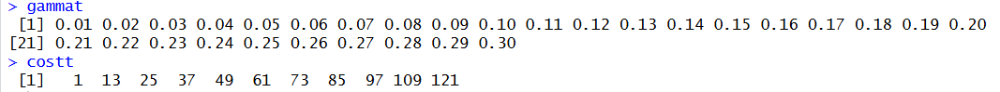

**Abbildung 16: Konsolenausgabe gamma und cost**

Nach Festlegen der Werte starten wir nun das Parameter-Tuning. Dieser Schritt benötigt etwas Zeit weil nun im Hintergrund sehr viele Support-Vector-Machines Klassifikationsmodelle trainiert und validiert werden (es werden Modelle mit allen möglichen Kombinationen von gamma und cost getestet)

	set.seed(25)
	# Starten des Parameter-Tunings (dauert ein paar Sekunden - bei größeren Datensätzen auch mehrere Minuten oder Stunden)
	tune1 <- tune.svm(trainval, as.factor(lc_classes), gamma = gammat, cost=costt)

Nach Abschluss des Tunings, können wir uns die Ergebnisse als plot ausgeben lassen (Abbildung 17):

	# Plotten des Ergebnisses des Parameter-Tunings
	plot(tune1)

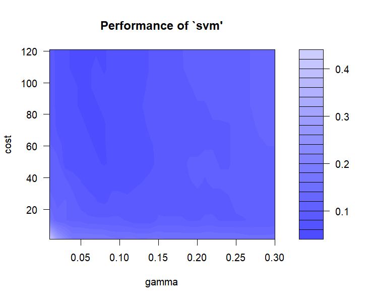

**Abbildung 17: Ergebnis des Parametertunings**

In diesem Plot wird der Klassifikationsfehler in Abhängigkeit von **gamma** und **cost** dargestellt. D.h., je kleiner der Wert ist (=je dunkler das blau), desto besser.

Die konkreten **gamma** und **cost** Werte, die zum besten Ergebnis geführt haben können wir mit folgenden Befehlen extrahieren und uns anzeigen lassen (Abbildung 18):

	gamma <- tune1$best.parameters$gamma
	cost <- tune1$best.parameters$cost
	gamma
	cost

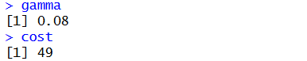

**Abbildung 18: Konsolenausgabe bester gamma und cost Wert**

Wir sehen also, dass für unseren Datensatz die idealen Werte für gamma = 0,08 und für cost = 49 sind (wenn Sie ihren eigenen Datensatz verwendet haben, können sich diese Werte unterscheiden).

Nochmal eine kurze Erinnerung, was die Parameter **cost** und **gamma** genau bewirken (Abbildung 19): Beide Parameter beeinflussen die Art und Weise, wie innerhalb des SVM-Algorithmus die trennende Linie bzw. die sogenannte "Hyperplane" definiert wird. Dies ist in Abbildung 19 veranschaulicht. Der Parameter **cost** definiert dabei wie sehr der Algorithmus dafür bestraft wird, wenn ein paar der Trainingsdatenpunkte auf der "falschen" Seite der Trennlinie liegen. Wähle ich einen hohen **cost**-Wert so versucht der Algorithmus die Trennlinie so zu wählen, dass möglichst wenige Referenzpunkte auf der falschen Seite der Trennlinie liegen. Ein zu hoher **cost**-Wert kann dazu führen, dass eine Überanpassung der Trennlinie an die Daten erfolgt, was in der Regel dann dazu führt, dass der Klassifikator nicht gut funktioniert, wenn er auf einen neuen Datensatz angewandt wird (was bei uns wichtig ist, da wir danach von unserem Datensatz von nur 175 Spektren/Pixel auf ein ganzes Satellitenbild mit Millionen von Pixeln skalieren möchten). 

Der **gamma** Parameter ergänzt den **cost** Parameter indem er steuert wieviel Gewicht einzelne Trainingspunkte in Abhängigkeit von Ihrer Distanz zur Trennlinie erhalten. Dabei bewirken hohe **gamma** Werte, dass Trainingsdatenpunkte, die nahe an der Trennlinie liegen im Merkmalsraum, mehr Gewicht  bekommen und Punkte die weiter entfernt liegen, weniger Gewicht bekommen. Je höher die **gamma** und **cost** Werte gewählt werden, desto stärker kann sich die Trennlinie an die Datenpunkte anpassen (und desto höher ist die Gefahr einer Überanpassung, d.h. eines "overfittings" des Algorithmus' an die Daten). In Abbildung 19 ist die Funktionsweise von gamma und cost grafisch erläutert.

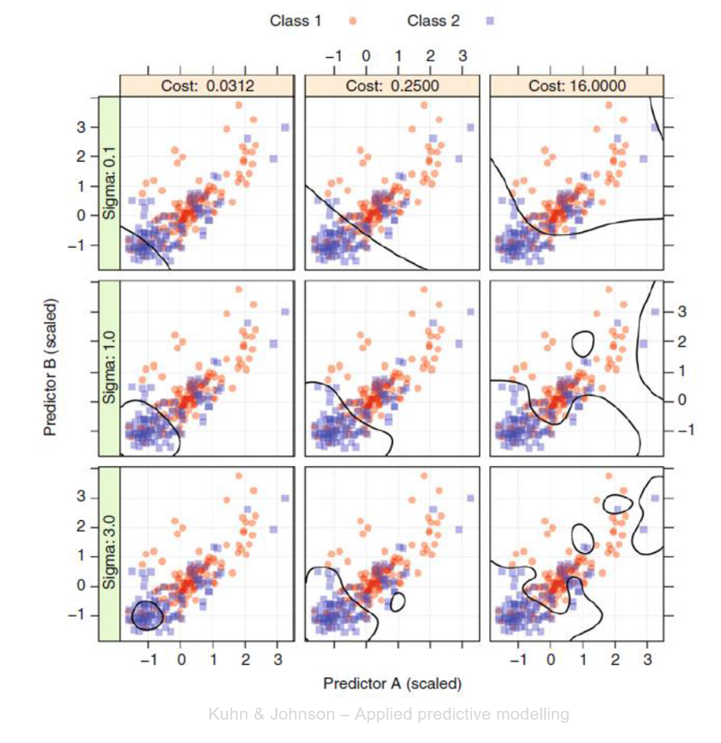

**Abbildung 19: Gamma und Cost erläutert (Abbildung aus dem Buch "Applied Predictive Modeling" von Kuhn und Johnson**

Nachdem wir nun die besten Einstellungen für die zwei Parameter gefunden haben, können wir nun das finale support vector machines Modell trainieren, welches wir danach auf das gesamte Bild anwenden werden. Dies können wir mit folgendem Code tun:

	# Trainieren des SVM Models mit allen Trainingsdaten
	svm_model <- svm(trainval, as.factor(lc_classes), gamma = gamma, cost = cost, probability = TRUE)

Mit diesem Code nutzen wir alle unsere Referenzdaten, um das Modell zu trainieren. Dies ist einerseits gut, um möglichst viele Daten bereitzustellen, aus denen der Klassifikator lernen kann, andererseits ist das nicht ideal, weil wir dann keine unabhängige Validierung durchführen können (mehr dazu in der Vorlesung).

In unserem Beispiel addressieren wir dieses Problem indem wir noch ein weiteres Modell trainieren bei dem wir eine 5-fache Kreuzvalidierung (was das genau bedeutet lernen wir in der Vorlesung) durchführen und uns dann die erreichten Klassifikationsgenauigkeiten direkt anzeigen lassen (Abbildung 20):

	# train model with 5-fold cross-validation to get first impression on accuracies
	svm_model2 <- svm(trainval, as.factor(lc_classes), gamma = gamma, cost = cost, probability = TRUE, cross=5)
	summary(svm_model2)

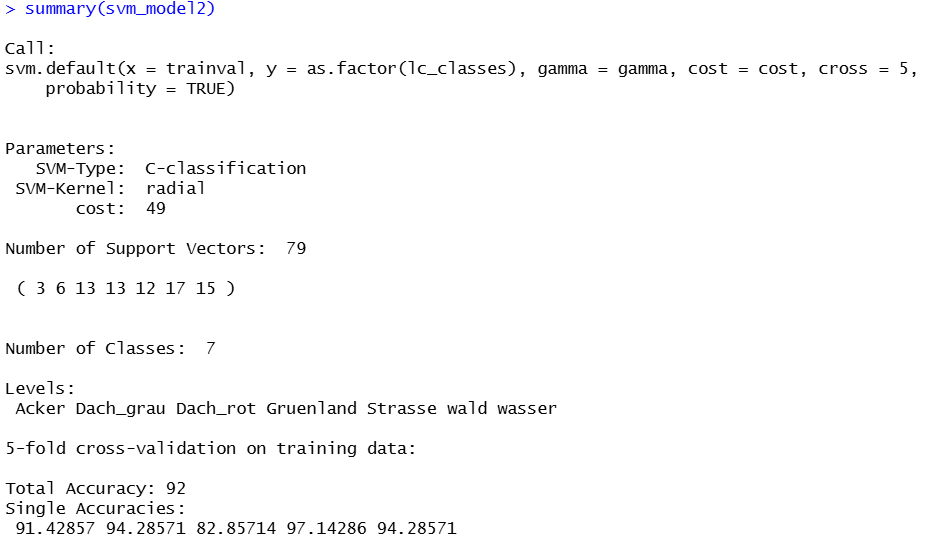

**Abbildung 20: Klassifikationsergebnisse basierend auf einer 5-fachen Kreuzvalidierung**

In diesem konkreten Fall erreicht unser Modell Genauigkeiten zwischen 82.85% und 97.14% je nachdem welche Samplepunkte in der Kreuzvalidierung für das Training und welche für die Validierung verwendet wurden. Die durchschnittliche Genauigkeit beträgt 92%, was ein recht guter Wert ist.

Als letzten Schritt, wenden wir nun das trainierte Modell an (hier verwenden wir das Modell, welches alle Daten im Training verwendet hat und dessen Genauigkeit wir nicht kennen, aber vermutlich im selben Bereich liegt, wie die in der Kreuzvalidierung gefundenen Ergebnisse). Im unten angegebenen Code wird das Modell auf das gesamte Bild angewendet und das Ergebnis sowohl in der Variable "svmPred" gespeichert als auch direkt in eine neue Rasterdatei namens "lc_map_svm.tif". 

	# Definieren des Ordners in welchen die Ergebnisse gespeichert werden sollen !!! muss angepasst werden !!!
	setwd("C:/02_Lehre/OEKB100130_Remote_Sensing_Landscape_Planning/02_Uebungen/Tag_5/Output")
	# Anwendung des Modells auf das gesamte Sentinel-2 Bild (dies kann einige Minuten dauern)
	svmPred <- predict(s2, svm_model, filename="lc_map_svm.tif", na.rm=TRUE, progress='text', format='GTiff', datatype='INT1U',overwrite=TRUE)

Anschließend können wir uns die erstelle Klassifikationskarte anzeigen lassen (Abbildung 21):

	 # Anzeigen der erstellen Landbedeckungsklassifizierung
	plot(svmPred)

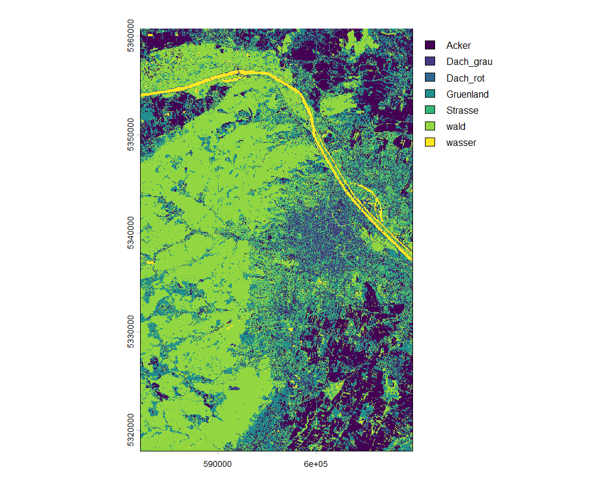

**Abbildung 21: Die resultierende Landbedeckungskarte**

Wir haben nun eine thematische Karte erstellt, die auch im Ausgabeordner als eine Geotiff-Datei namens "lc_map_svm.tif" gespeichert wurde. Diese Datei kann nun z.B. auch in QGIS geladen werden und dort als eine thematische Landbedeckungsklasse visualisiert werden (über Rechtsklick auf den Layer ⇒  Properties ⇒ Sektion "Symbology" können die Farben sowie die Bezeichnungn der Klassen angepasst werden; über die Option Project ⇒ New Print Layout kann eine Karte erstellt werden - siehe z.B. auch hier: https://github.com/fabianfassnacht/QGIS_Tutorial8/blob/main/Tutorial_8_Making_a_map.md) 

In Abbildung 22 ist ein Beispiel für eine solche Karte dargestellt. Zum Vergleich wurde derselbe Kartenausschnitt auch mit den Google Earth Satellitendaten visualisiert.

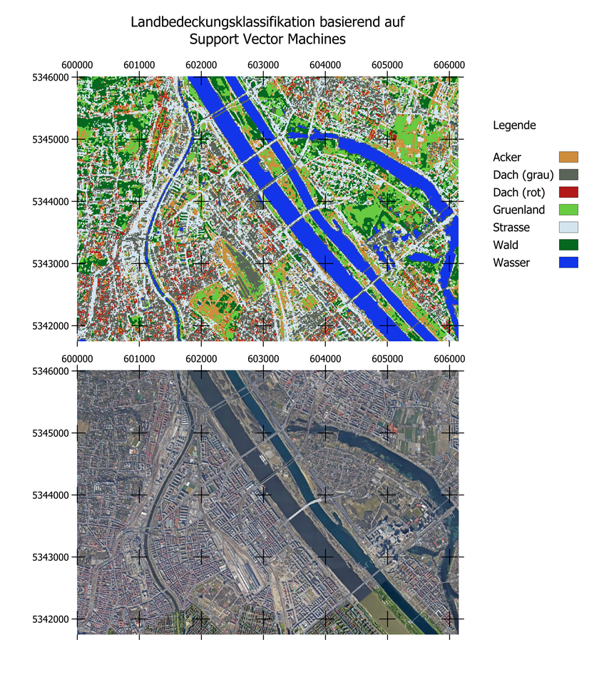

**Abbildung 22: Aufarbeitung der Landbedeckungskarte in QGIS + Google Earth Ansicht zum Vergleich**

## Hausaufgaben

Die Hausaufgabe für diese Woche besteht darin, eine Landbedeckungskarte, so wie heute gelernt, für **eines** von drei Testgebieten zu erstellen, die im GIS-Projekt ebenfalls untersucht werden. Sie finden Vektordateien für die 3 Untersuchungsgebiete hier:

https://drive.google.com/file/d/1p_Bsx1x2oJrBzyDWNvY4Xu7KnnbZDwM2/view?usp=sharing

Die entsprechenden Sentinel-2 Daten können Sie hier suchen und herunterladen:

https://browser.dataspace.copernicus.eu

Dafür müssen Sie sich erst bei dem Portal registrieren und dann können Sie, wie in diesem Tutorial erläutert Daten für das jeweilige Untersuchungsgebiet herunterladen:

https://www.youtube.com/watch?v=NExWcI1zSE0

Anschließend müssen Sie, wie bereits im Kurs gelernt, die Sentinel-2 Daten in SNAP als Geotiff-Datei abspeichern und dann den Schritten des heutigen Tutorials in QGIS und R folgen. Es kann sinnvoll sein, die Sentinel-2 Daten auf das Untersuchungsgebiet zuzuschneiden, da dies unter Umständen Speicherplatz spart und die Prozessierung beschleunigt. Sollten die Satellitenbilder, die sie finden, nicht das ganze Untersuchungsgebiet abdecken, ist dies erstmal kein großes Problem. Suchen Sie sich einfach eine Satellitenbildszene, die einen möglichst großen Teil des Untersuchungsgebiets abdeckt. Wir werden zu einem späteren Zeitpunkt eine Lösung für dieses Problem im Kurs diskutieren und falls Zeit bleibt auch in den Übungen implementieren. 

Da die Hausaufgabe eine etwas größere Aufgabe darstellt und einige Schritte zu Problemen führen könnten (z.B. Anpassung der Koordinatenreferenzsysteme, Auffinden einer geeigneten Satellitenbildszene, etc.), bekommen Sie für diese Aufgabe zwei Wochen Zeit, so dass wir etwaige Probleme nächste Woche in den Übungen diskutieren und lösen können.

Als Nachweis für die Bearbeitung der Hausaufgabe laden Sie bitte einen Screenshot der Konsolenausgabe über die erlangten Klassifikationsgenauigkeiten sowie 2-3 Beispielsausschnitte der finalen thematischen Karte, bei denen Sie so nah an die Karte herangezoomt sind, dass die QUalität der Karte beurteilt werden kann (ähnlich Abbildung 22 oder noch etwas näher herangezoomt). Erstellen Sie jeweils auch immer eine zusätzliche Karte, die die entsprechenden Google Earth Daten zeigt.

